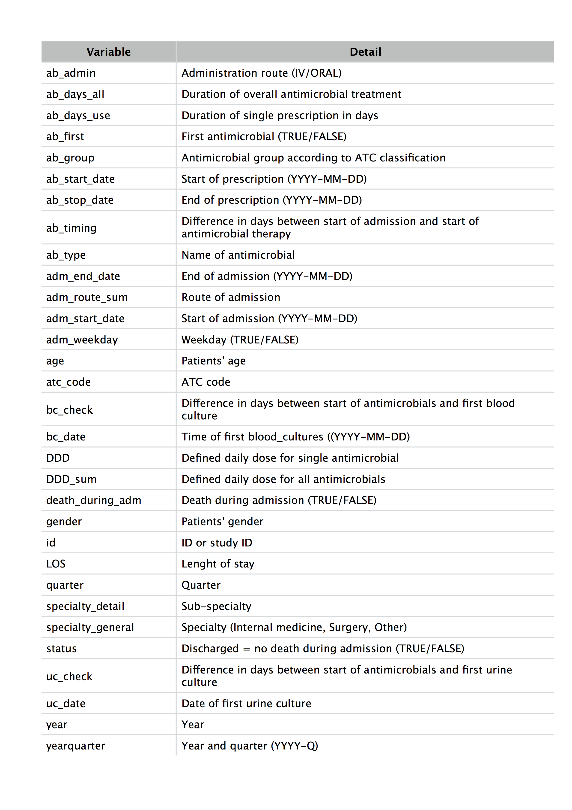

# `AMR` 
RadaR is an application for intuitive, rapid and reproducible quality of care pattern analysis of infectious patients. 

## Prerequisites for using RadaR
RadaR was built in [R](https://www.r-project.org) , an open source programming language using the [Shiny package](https://shiny.rstudio.com), a web application framework for R. Users will need to download R in order to use RadaR and we suggest the use of [RStudio](https://www.rstudio.com). R is completely free to use. 

# Input type for RadaR's calculation
RadaR works with standard csv-files (.csv). The variables needed for RadaR are as follows:

Usually different data sources need to be merged for the desired result (at our institution three different sources: general data warehouse, pharmacy data, microbiology data). For an easy and rapid creating of the needed datasets that can be loaded into RadaR, an additional R-package will soon be available here in this github repository.

## Authors

RadaR was created at the Faculty of Medical Sciences of the [University of Groningen](https://www.rug.nl/) and the Medical Microbiology & Infection Prevention department of the University Medical Center Groningen (UMCG) by [Christian Luz](https://www.rug.nl/staff/c.f.luz/), PhD Student.

## Copyright
[

RadaR is licensed under the [GNU General Public License (GPL) v3.0](https://github.com/ceefluz/radar/blob/master/LICENSE). In a nutshell, this means that this package:

- May be used for commercial purposes

- May be used for private purposes

- May be modified, although:

  - Modifications **must** be released under the same license when distributing the package
  - Changes made to the code **must** be documented

- May be distributed, although:

  - Source code **must** be made available when the package is distributed
  - A copy of the license and copyright notice **must** be included.

- Comes with a LIMITATION of liability

- Comes with NO warranty
